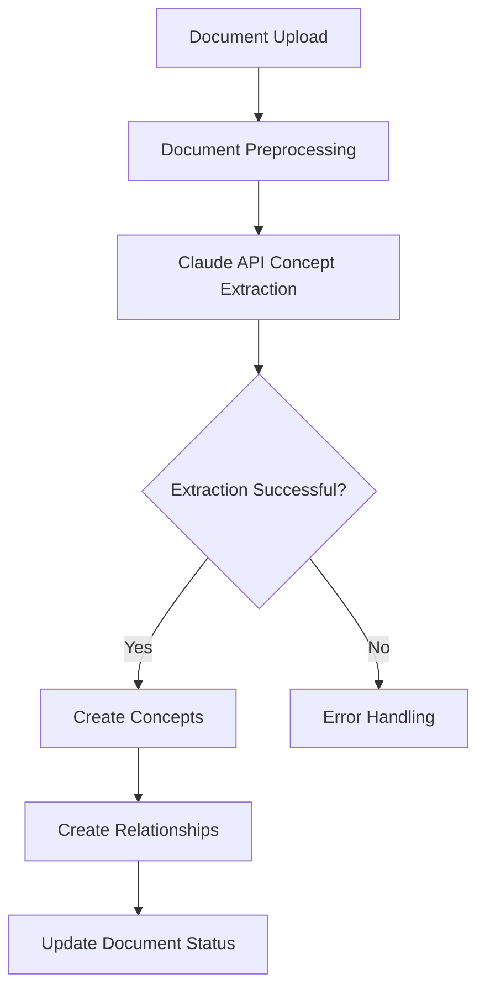

# AI-Powered Concept Extraction

## Feature Overview

The AI-Powered Concept Extraction is a sophisticated, intelligent document analysis feature that transforms unstructured text into a rich, interconnected knowledge graph. By leveraging Claude 3 Sonnet's advanced natural language understanding, the system can automatically:

- Extract key concepts from documents
- Identify complex relationships between those concepts
- Generate a structured, machine-readable representation of document knowledge

### Key Capabilities
- 🧠 Intelligent Concept Detection
- 🔗 Relationship Mapping
- 📊 Confidence Scoring
- 🔄 Multi-Document Analysis
- 🛡️ Robust Error Handling

## Technical Architecture

### Components
1. **Extraction Engine**: Claude 3 Sonnet Language Model
2. **Processing Pipeline**: Convex Action & Mutation System
3. **Storage**: Convex Real-Time Database
4. **Error Management**: Multi-Layer Retry & Validation System

### Workflow


### Extraction Process
1. Document content is preprocessed and truncated if necessary
2. Claude is prompted with a structured JSON extraction request
3. AI generates concepts and relationships with confidence scores
4. Results are validated and stored in the knowledge graph
5. Document processing status is updated in real-time

## Concept & Relationship Structure

### Concept Schema
- `name`: Primary concept identifier
- `description`: Detailed concept explanation
- `confidence_score`: Extraction reliability (0.0 - 1.0)
- `category`: Concept type classification
- `aliases`: Alternative concept names
- `document_ids`: Source document references

### Relationship Schema
- `source`: Origin concept
- `target`: Destination concept
- `type`: Relationship classification
- `strength`: Connection intensity (0.0 - 1.0)
- `context`: Relationship explanation

## Configuration & Environment

### Prerequisites
- Anthropic API Key
- Convex Project Setup
- Next.js 15+ Environment

### Environment Variables
```bash
# Required
ANTHROPIC_API_KEY=your_anthropic_api_key

# Optional Performance Tuning
MAX_CONTENT_LENGTH=8000  # Maximum document size for processing
MAX_EXTRACTION_RETRIES=3 # API call retry attempts
```

## Usage Guide

### Processing a Document
```typescript
// Trigger concept extraction
const result = await ctx.runAction(api.concepts.processDocument, {
  documentId: documentId
});

// Result object contains:
// - success: Boolean
// - conceptsCount: Number
// - relationshipsCount: Number
// - warning?: String
```

## Error Handling & Retry Logic

### Supported Error Types
- `DOCUMENT_NOT_FOUND`
- `API_EXTRACTION_FAILED`
- `CONCEPT_CREATION_ERROR`
- `NETWORK_ERROR`
- `CONFIG_ERROR`
- `PARSE_ERROR`
- `RATE_LIMIT`

### Retry Mechanism
- Exponential backoff strategy
- Maximum 3 retry attempts
- Detailed error logging
- Graceful failure with informative messages

## Performance Considerations

### Optimization Strategies
- Content length capping
- Batch processing support
- Efficient database indexing
- Minimal API call overhead

### Scaling Limits
- Recommended: < 10,000 characters per document
- Optimal performance: 2,000 - 5,000 characters
- Rate limit: Approximately 1 document/minute

## Demo Script for Judges

### Presentation Flow (3-5 minutes)
1. **Problem Introduction** (30 seconds)
   - Information overload challenge
   - Need for automated knowledge extraction

2. **Technical Demonstration** (2 minutes)
   - Upload a complex document
   - Show real-time concept extraction
   - Highlight AI-generated knowledge graph
   - Discuss relationship mapping

3. **Technical Deep Dive** (1 minute)
   - Claude 3 Sonnet integration
   - Convex real-time database
   - Confidence scoring methodology
   - Error handling robustness

4. **Impact & Potential** (30 seconds)
   - Research acceleration
   - Knowledge management
   - AI-powered document understanding

## Potential Future Enhancements
- Multi-language support
- Domain-specific fine-tuning
- Enhanced visualization
- Machine learning model feedback loop

## Licensing & Attribution
- AI Extraction: Powered by Claude 3 Sonnet (Anthropic)
- Infrastructure: Convex Real-Time Database
- Framework: Next.js 15

---

**Developed with ❤️ for knowledge transformation**